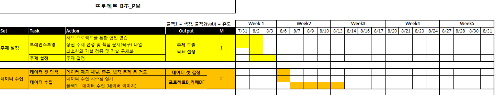

# B조 M3&M4 프로젝트

## 파일명 저장법
##### B_proj_문서종류_제목(내용)_작성자(혹은 수정자)_몇 번째 수정.확장자
```
< 예시 >
B_proj_docs_title_soryeong_ver01.docs
B_proj_image_title_miningful_ver02.png
B_proj_code_title_ahlum_ver03.ipynb

```

## 진행상황공유


## 색감 지도

```
서울시 카페의 색감을 지도에 그려보고, 인구통계학적 특성과 색감이론 등을 연결지어 Insight를 도출
```

**진행 과정**

1. 각자 서울시내 지역별로 유명 카페 상위 30개를 검색
2. 검색한 카페 내에서 '매장 내부'를 촬영한 이미지와 주소, 이름 등을 스프레드 시트에 저장
3. 이미지를 불러와서 색을 추출하는 코드(Image Cluster)에 넣음
4. 구글 API를 활용해 주소의 위도와 경도를 지도에 찍기
5. 지역별 특성과 색감이론을 찾아 지도의 내용과 연결지어 Insight를 도출


## 기온변화와 배달 건수의 변화 그래프

```
최근 폭염이 지속되면서 데잇걸즈 내부에서도 점심 배달 주문이 늘어난 것과 같이,
작년(2017) 여름 기상청과 SKT 배달음식 전화주문 데이터를 분석
```

**진행 과정**

1. SKT에서 제공하는 2017년 6~8월 배달 전화 주문 데이터를 다운받아 데이터 프레임으로 정리
2. 기상청이 기록한 2017년 6~8월 기온 데이터를 데이터 프레임으로 정리
3. 배달 데이터를 카테고리 별로 묶어서 개수의 변화를 확인
4. 꺾은선 그래프를 활용해 x축에는 기온의 변화를, y축에는 배달 주문 수의 변화를 나타냄
5. 배달음식 카테고리별로 꺾은선 그래프의 색을 달리하여 차이가 있는지를 확인
